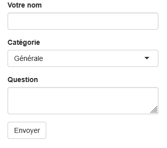

# Partie 1 - Consigne exercice 1

## Introduction 

Vous devez créer un simple formulaire pour recueillir des questions au sujet de Shiny. Vous faites cela en rajoutant différents inputs Shiny sur un UI.

## Tâches
* Recréez la disposition comme l'image ci-dessous. Vous devez ajouter :
    * Un input de texte pour le nom de la personne
    * Un input de sélection pour les options suivantes : Générale, Développement, Déploiement
    * Un champs (*area*) de texte pour écrire la question
    * Un bouton d'action pour envoyer la question
* Ignorez la fonction server pour cet exercice. Ce formulaire ne sera pas actif car nous ne faisons que construire l'UI.

## Output attendu

## Lien Shinylive

https://shinylive.io/r/editor/#code=NobwRAdghgtgpmAXGKAHVA6ASmANGAYwHsIAXOMpMAGwEsAjAJykYE8AKAZwAtaJWAlAB0IdJiw71OY4RBEBiAAQAROADM+cRQFUAkooC0RgyICutRQB4Di1FADmcAPprq5gCbsRIxYqUBJgkZaADc4AC9Fai1idy1aAlpvCFkFFXVNRU44RjDGRXY4GFRSQUNjEWzcnKsbNVMIAlJaEnY+VFNSXEUiTo6urLhOThaUxRARAF9kpQBhRjgockUAZV5+RTRUcqNK9dYAQXR2c26qvNkwSYBdIA

## Référence

* [Composants](https://shiny.posit.co/r/components/)