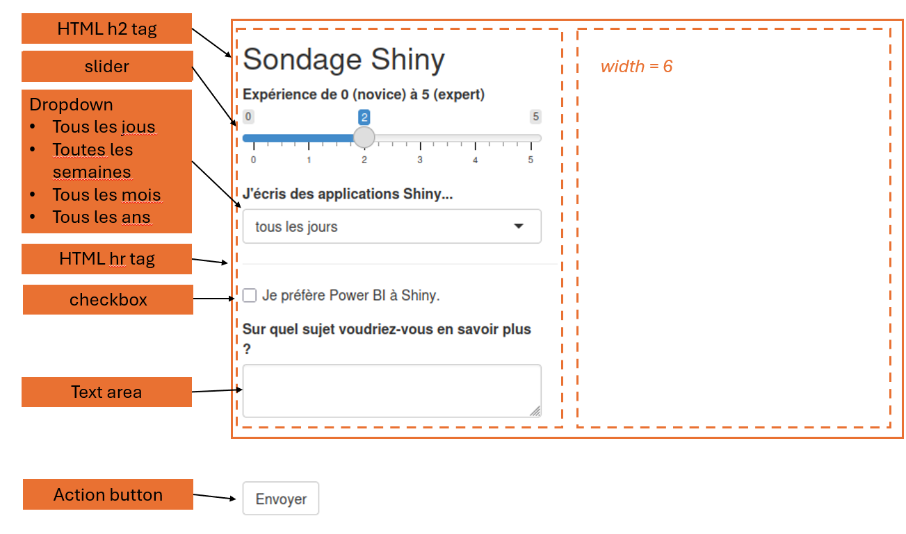

# Partie 1 - Consigne exercice 2

## Introduction 

Vous devez créer l'UI d'un petit formulaire de sondage pour récolter des informations sur l'expérience des utilisateurs avec Shiny.

## Tâches
* Recréez la disposition comme l'image ci-dessous. Les types d'éléments input et d'output que vous devez rajouter sont fournis dans les annotations orange :
    * Tous les inputs se trouvent dans la première colonne (_width_ 6)
    * Un emplacement fictif pour le graphe se trouve dans la deuxième colonne (_width_ 6)
    * Le bouton ne fait partie d'aucune colonne et est placé en dessous.    
* Placez les colonnes dans des fonctions `div()`.
* Ignorez la fonction server pour cet exercice.

## Output attendu

## Lien Shinylive

https://shinylive.io/r/editor/#code=NobwRAdghgtgpmAXGKAHVA6ASmANGAYwHsIAXOMpMAGwEsAjAJykYE8AKAZwAtaJWAlAB0IdJiw71OY4RBEBXWgAIAPAFolqKAHM4AfQBm1RQBN2IpUoDESgJIROAS8ZwAXktK1SLpbQK0LJWooViJ5Uj1iYxgHcwhLSyi9AHdaE1JuTiUAXiUMfNxAyxNaADc4hISbeycXd2o4LMdqR3gyLJMAcj5UcN9-IqUBQviEkvLZS1lZEU44RlL51Q0DeQgCTxJ2HvDcJTDSXtI9uc5OWhIBJRAAXxFZ3n4AQXR2RRP5xcZZMBuAXSAA

## Référence

* [Composants](https://shiny.posit.co/r/components/)