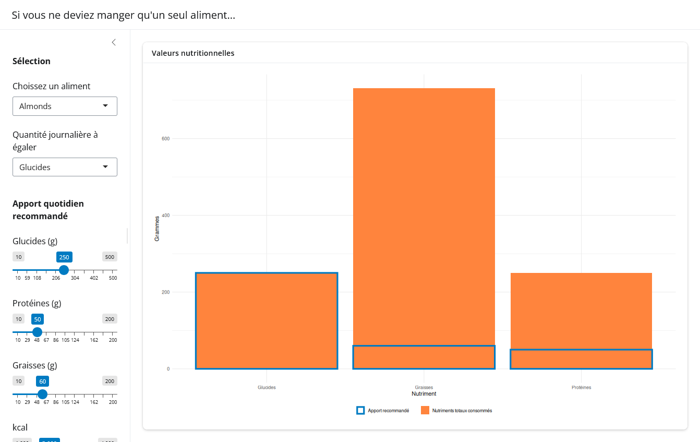

# PARTIE 2 - Consigne exercice 1

## Introduction

Explorons une question hypothétique :

_Si vous ne deviez manger qu'un seul aliment pour le reste de votre vie, lequel choisiriez-vous ?_

Voyons maintenant dans quelle mesure cela serait bon pour votre santé et comment cela affecterait vos apports quotidiens recommandés en macronutriments.

On vous a fourni une application contenant déjà toutes les données requises, ainsi qu'un code R/ggplot2 basique et non interactif permettant de générer un graphique illustrant la répartition des macronutriments si vous ne mangiez que des amandes et que vous visiez une consommation de 250 g de glucides par jour.

## Tâches

- Ajoutez une carte dans l'espace principal de l'interface utilisateur (UI) intitulée « Valeurs nutritionnelles » contenant un graphique
- Créez une fonction de graphique sur le serveur et déplacez tout le code à l'intérieur de celle-ci
- Reliez tous les inputs pertinents au graphique : le résultat s'actualisera comme prévu

### Défi supplémentaire (facultatif)

L'ensemble de données contient également une colonne indiquant le nombre de grammes par aliment. Ajoutez un titre au graphique indiquant combien de grammes vous devriez manger pour absorber la quantité actuelle de nutriments affichée dans le graphique.

## Output attendu

## Lien Shinylive

[Lien](https://shinylive.io/r/editor/#code=NobwRAdghgtgpmAXGKAHVA6ASmANGAYwHsIAXOMpMAGwEsAjAJykYE8AKAZwAtaJWAlAB0IdJiw71OY4aIbM27AOZLU1IqQBMssQo4ATNa0Y75E9qVr7jskfqikoAAgA8AWieM4UfRgKcAN3YAcgAzIiJ9Tj9A4Nl7R1cPBOcAHwA+JxZmCCU4dgAxCP1ZaHhOdhSBJKcCdhEnJ2CAQTp4MmDcBqaAcWYYcs7u4IBhKHVGWjhOIYhG4IAFRg0AS75p2fm+qFpOTg2uud7mXf3OJwBlBwxNpoL5A+Ge6gBXAitHo9GHFaUiSbgwREtggL1oNVQUDyAH1OB96Cx6kdLKRqHAnABeJxCMAXcEBIgvc4QdH6OABKYALycMCguTgjCcAEcXsEXnN9i9qFk2hRSBgBdi8N04WSEYysaK4OKkY1Go4lJwACTUKD0ODUeq4lZogiWEg43C1VV7TFC0IAdzc9CI1H0OIEhzlTn2usslLgAEkIKgXqQteFIoahSNuERTnBqeyebR2qRgwQw7QCNMzSlgMAca1Y3ycQBdPOO7qNV1wPW0D3e33+4tynEsunx4VHZ04gCKL0btFIKycACtCYxoHQABdeJwAA6cv3GDMNtcaifDKfOWLqOOebw+nGDG5Oe2mu7AYwmUx3YFkzqLLacCuVqvVmqz6H+pGZLw0Vimcy8xAGdP0FYExNVdzStG07RpUg3AAZgdJ05WkD5GCrP0tQIFgpCPTd3jJc5lGEPAaT4M0AEYAAYjVpAAPM0AFZyMopwAnGF50SxTQGOvZ0kLJFCfTQnFUGWcg+CPJZVnWfClEIqiSKxCiqKgWiOMYo0WNedinC4hCSzoPjUJrMBQgcbD9zOJwCODGB5KcRSaWUs1NDU5jWK0gA2cjuMQ-SGUM9Dxn+M8jwAaxPc85LmBTGKYmizQAFhi9S3KcmLLycWQQX2RgAgZGpQnZcsSHYPhqyNQlSDKl1pjhEhqhAboAGJLg1Ms30DfRbyIJxwgIIknDgDAlAwJxWhgEgom6DqahSJwMlrUJaGochGHYbM40xLEs2ocaIEmi85vSWtSz1dhtgGaYjRPILLqcCSeyko1tgjTgnteXDpnS5qejgN8SPUXIev+Wl4yOab3CByJDqcVBaAJUhoQBvJVvJBlWFIXhcnYR0nDKaZoVIbqtsgWA4AdJrRv0PsiTfBF9k6khaiIGBUBIPkuoc0hEyyPbqrfewltYW8WDyP6yCgEL0UG4anE48ilCcIhQlqTCdyOTgMLRaETL1f58uKaHFuWhl2DxzahRw7cHWh31qE1DS2PS8GPGmjIaT9Bx8gdrTvacAB6F1NbgbWoF1xkACpZa4imfrfDH0UcRhRacAXqCFvhHEl1zNLV+URd+maHCgDBQn6fJazNtctXutYSQii3zMPIiN3eq2L107O2LNOoGKNTyjTl9KvqcEYvE929uHRNQNG6FRp-9aoAGpazyZnoWIJ8b0aWasVdzIjZW03SacABSPgT9qauRNrpujT3HYD3rlutzwh1vOdKBpnYFTcdJo0haxN7I0RtuTEwAHJ+kmHGc4hNHAvFosQCAnBmYwBWOedKjQl4rzgGvDespnQpyLmaROosO6NE-hUH+eN-5miAUzCYZpnys0YG+X8KCAJAXbguHqS1QFODAc0MhTg6AkgtFYDGZEMB0VrFgm8GtZza14dCWkoJxjsG9qBdcYAIGkCgXyGBGgoDwKZkglBaCcSMLAI1UIoQAAc8UYL2gvLIniQd162n+MouknZ7ZuU0VqZoL4WGeDLOwvanDLGNUYgAdnoAQTQb8nDLxvA+ShlidF6LIMGABDdYDlGDCAs0YCACqAAZUpRoN56yxCU8pLi5Tx3gMovgsY1H1PlJPeA7A0R5D2hgVmcJ9RRSFDaUghMYDkwgAAXxECIHgfBWCBNQOwMERpsq5RMCIMAUzcDgDxlQDq0R-ABDwIQEg5BKDICKJEXA51XrXQBK9e6cA+C4AKA4XAVx+TvNIG8hgDJcBjEYFIQFns-hsBECMIgFoZjEWoCFXAABOaJ7lcDuX7jBTQuBEq4Bgqiyi8VbG4AACI7DYDDZY+g3ikDVgAIT9CtGy8LcCaHiqi0imholItwHRbFuBKKkRgiSslQthKRGpWrIoLDaCLTgJ1JlCLSLxVIoi3AgrolCtsaq+KWLNBCtIhgeKaqVXCtoOSsVVK9RqwWNCvicq4WKvIkKuipFeWcpZUS1l-LcWqtJWa0VlKJUiB6EQBwsKFUsvika0i7leVEsUkSgVpFTXmsDVayFRBiBQBZXRXVME43GrVZRSimhUV+tTeK9NEARg0xYPoSNnrbG8sFWq6NyaS1EvLQGytNKRCehTLUMeMA1W2KJTBNS7L434pZb6kVFKe1q37eiCNKqS3RN5aqxSqrKKYpTd2y1vbq1DsVoybg4xQhuAAm4M91BQhqucmq6JBK1XNqFZRXlXb50HrVqGOA0w4Ass4pGndSai3erLXOi1Qaj3eBgLUSe-6PVFrdYWxSAq91fugwAURUOcC4BB+j0DRAzRkpcpj1o5Z6h9LaY2tu9cmz9UGq30rGQC0iHLjX6qVca5ttH2NcvY0SnEPzXpOAAPJLVExcMMLCKB8EVDiEQLGVrGqxexrjbbePstIgJ0iQmwAiaNBJ6gUmZMXPk+eJTocSBqtRYi3lRqiVcvQziAAst4X5d1CTLQhWASFqoYCvSbbgWxAm1PepLV0AzuxuBGguN4Dqimj1qhpB5kLG6BVGqxcWtVUX7g8Diwl4oSX8vcBdJYAgIVzhkblapllakTWKV5ZRfTpXCtQES35iAAAJHw+hM0IuC4K5tqKHPgbyzF9rnWRBidYJwFar09UlpgsmvVeahV6qy-mlleKJsFZah14rXX8PjHUKgV6FEBXkWjUSxN9HKLCcmwd6bEAsD2pClYEkrAWX9yWy+3LJapHYqxQANTgKLNUaJzjNDcFhkQpK9oaloIzJQXgKAXdsS199APcUYDU6isHEOiOphh3DiAABpWcxqCVjfbfyjAqqiWE9+pD1MBQ3ALBEAsFgnAIC0HOy+jdKG6cbdB+DlnxPzjs85xABYcB0AMnOGIiR6o4DKwAoOl4MAQWupLXRZtqrGe5a9czxwkunBYDcAALS54YwmqZXNQB4Pa5XZWFU806vQBlALnLLefRx9j9OuWaCZ+Ls3UOLfW5EBcIgrB1R0kW2pUtJa1Mi7x-V3ApvWfnEtzbiAFwLR-rfKzRw9uLuKVdcL+juKCdh+z5HvPAAVF4Q5+dOFR3+pBraHO0-oxgW7me6-m9zyIZoBIML9aLfG4Lan41qf72it5jAwQ0tGm4AoSnVSVfVIwR5rbHNV8ou5DA7LVUFGX92aH6-IWT132eHNAmk8491ai8-K+r8b4gGJuguVziqiTgBrGrgNEuFluvTmOkvu-k4D0BzjNj-tMFgPzoAc2uRM2mqvqqAZAZftAbAbLsvnXCyk+rimpPqhFgvrYsmm-tgTATLgAOqeyMDwAAxIpAYcqRZp6oqaBn4X6r4j6vasAAZ6o8pV7toYDJocY4i0pjxRCVIMjeAmbAJO6kAdS4Co47BIJJa0FhhohuAWiTwfLxR0RtpqSEp0aKTuTRJA6aC0aSHSGiYphjwKE9RKEqFqF8CWYQBaG2hwC6H6G-JCH64so47kQYAraFq2HeAyG1ByHjCiYmTzauEnAaFdZQpDhOBMCRHt7LDsjyryE8pXY7p8rZahH-YRE+D2ExFOHxHKHFCqFJEeGpFzDwDjDGpjr9zapBEGqorRJGplFREOHyFxEuG1FuHJEiAFDqAt7U7YoYqqqaDZYsoM64pCp9EVGOFDEJEjH1GaF+GWSnYwwt4DJwCOjsYEoNbhbFolH2JRZSGRFrGDGKGbE3KjEeFaEeaWR6HeEnEPowSIoCobbeqaAL7RKqqrGyHrGPE1HPHbFdaO4YTLB86toCqBFoGXHJq7pgnREQnOFPH1ovFJZgLFBQ62YlpqTB5BEhHolcqYkDGxGQmJHqEeFiYODNHUA7bsq9y8oAnxQn4-Y3F2HgkPE4lQl4kwm26oDEBpGcDjDkD1oh4vpYpCrkkhFuoPZgC3HlGCl0nCkMnuFJaIEpj1ZOamGuq4p95qZGH8l3FalVHDHQmMn6m2gKG9zKron3qFqUk7ZWmalYlCnVG6ljH56QhKCTxjLgiu6pYOAuhGKGlyweqvpgb4pA7bY0mVEbEil1EOnHbcBeD6BkidR6HvH0C7B9TdhIaXZml04hHB4rHqkCm+nan+lbFZkiD0E2LEnrrAYhbcqiHolqkan9Fpn0nNl6ldZvFRnIzDruSeqGGPrAFmlAlcm9F1nWkNm2m4mZmjlKbeAciEioA5oCp-HdljYhGorjqfJ7l0p-rKzIIvD7lxkVmopGpGoqmFox53k-q8CVYUAuh7kHnAFja6r3YXkfn+awDwa2o+6BHBYoaJpA4cbvnnaQrHq3kC6cSqmURhaobp56YgVIVBl0DQSoDeC-l3n-lKpcoQFvpWG8qIVqyN7MwODdSoWRrNqdndGL6vnzF4V0rSEHF5nyb1Y7o9Goap705Yp0Soo4jEo1QMg0prKF6-QNFhgbzjwFT6B5D3oEoPrNrRrFFKlqkyUHgsKiacCKW9pdZUFvgYSSzEHIZBFGrUVqbUlgBGXZTyUujmUeEXCsz0gqy2U4rsZclBELHcXSWyUmUKVF4eGuZLQhQQWqXkA8qcFHlYqopJlYpRpRZuVyWmVeVJa-q75CwLBTDoFLmFE0a9nCHZURUeVmXRUFW1qMAUbnmlq8q6ZgY7rLk5WRWeUNVdalJwC7SpaTC5BsRaXEH+5qZonYq8rhXGV1X5Wwl8CGnDa4o4pCpG7VlopYrzXuV5X9Vc5a6oAfZzAlUAaColpAHNpiVjrdW1UHVKVJaN5oDI4YSDqwb8X6CCVxkwTbYV6UTbrA41ULWPUWWj47QTSvREE6oJkwSNpqoL4trxZyrnAa46K8VQCUhLS4x+jQ006P7YpcphFYpcoo1RAe78J42QpO6TwwrAE7qIpqaKm6pwVzGUTk1o28wY0iDECIJ+h9W-QUC1a9ycrRoZ4mov6fJ-oU3o3U2y47kC1e6saMD5GTXumsHOZLGqqc2U080K3eLyWi1HktqsHsrp460y1c2dT61y4YRd65rrXOq4purNpiHzm61y2HrxbSnwDVSo1q0h6A2RroG47iEc1W163y0XDsihDqCF6Mj7AB2i2Y4a0cUGqboR2o1R2Hr0HUCghG07pAbE2k25ZEqe3c143bJ5hAA)
